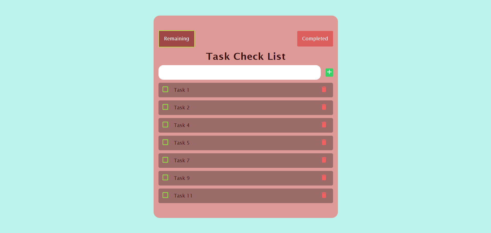
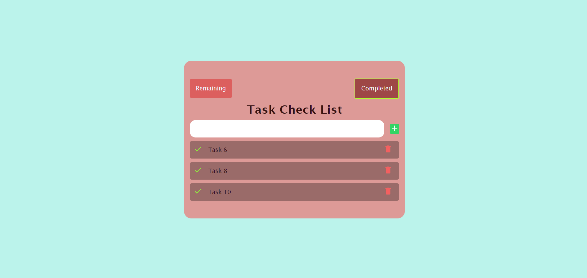
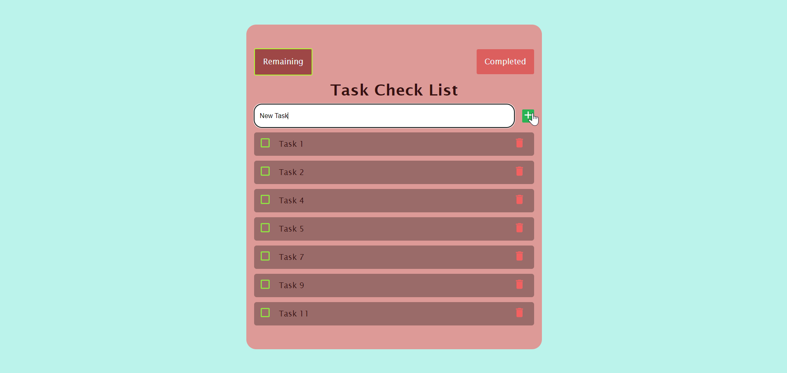
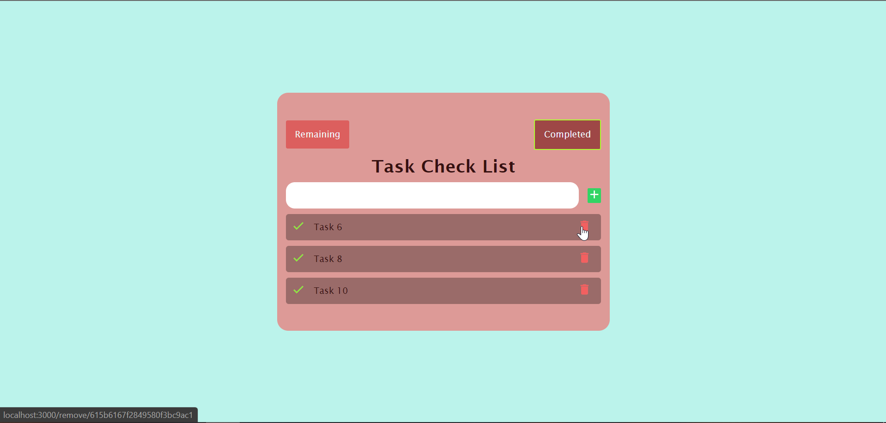
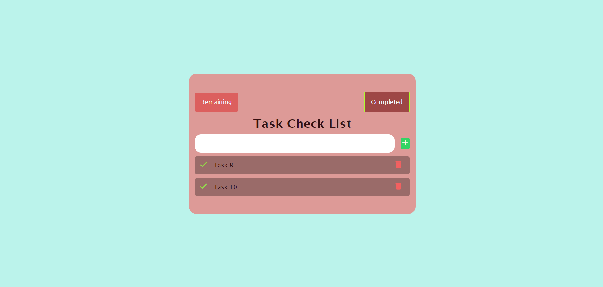
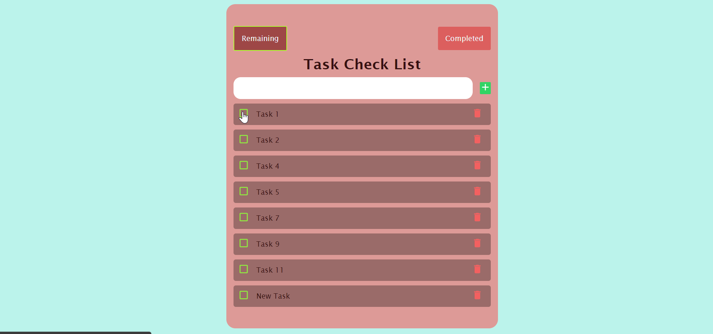
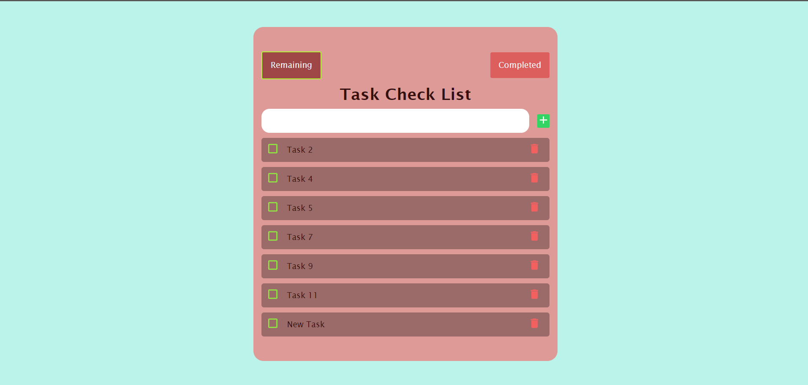
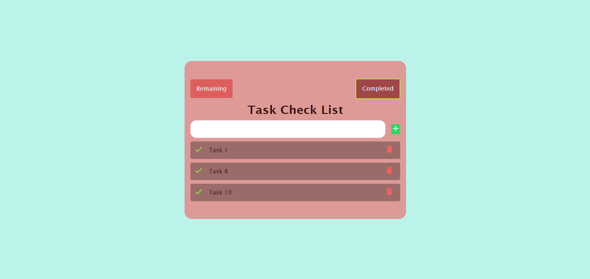

<h1 align="center">
<br>
<br><a title="EducIcons, CC BY-SA 4.0 &lt;https://creativecommons.org/licenses/by-sa/4.0&gt;, via Wikimedia Commons" href=""></a>  

Task Check list App
</h1>

<h4 align="center">A Node Js, Express Js, MongoDB CRUD application to create new Tasks, checkout remaining and completed tasks, Upadate their values to set as completed and to delete List items.</h4>

<h5>Live deployment at: <a href="https://mongo-task-app.herokuapp.com/">https://mongo-task-app.herokuapp.com/</a></h5>

<div align="center" style= "display:flex; align-items:center;justify-content:center">
<code></code>
<span>&nbsp;&bull;&nbsp;</span>
<code></code>
<span>&nbsp;&bull;&nbsp;</span>
<code></code>
<span>&nbsp;&bull;&nbsp;</span>
<code></code>
<span>&nbsp;&bull;&nbsp;</span>
<code></code>
</div>
<p align="center">
  <a href="#screenshots">Screenshots</a> •
  <a href="#how-to-use">How To Use</a> •
  <a href="#license">License</a>
</p>


## Screenshots

  - Landing (View remaining Tasks)<br><br>
    
    <br><br>
  - View Completed Tasks<br><br>
    
    <br><br>
  - Add a new Task<br><br>
    1. 
    2. 
    <br><br>
  - Delete a task<br><br>
    1. 
    2. 
    <br><br>
  - Update a task<br><br>  
    1. 
    2. 
    3. 
    <br><br>

## How To Use
You need <a href="https://nodejs.org">Node.js</a> installed to run this app.
Clone this repository and open index.html<br>
From your command line:

```bash
# Clone this repository
$ git clone https://github.com/shivang02/MongoToDoApp

# Go into the repository
$ cd mongo-app

# Install node_modules
$ npm install

# Run the app
$ npm start
```

## License

MIT

---

> GitHub &nbsp;&middot;&nbsp; [@shivang02](https://github.com/shivang02)
